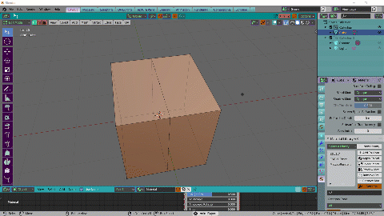

# Multijoin Addon (pie menu) 
press J to do a normal join
press J and drag mouse to open the pie menu:
* multijoin   
select several vertices and one last vertex to do a multijoin  
* slide and join   
select a subdivided edge (select 1 extremity press ctrl and select the other one)   
and a second edge not subdvided (press shift and select the 2 last vertices)   
it will subdivide the second edge with same amount of vertices and bridge   

N.B: for coders this addon registers a key and modifies another one   
and then inverse the process when unregistering.  

